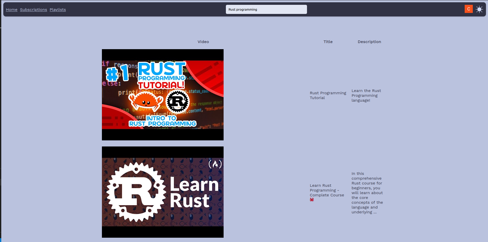

# DistractionFreeYoutube

Browse YouTube with all your playlists in a custom UI without having the extra distractions of shorts or recommendations.

_This is a WIP. I wanted a program similar to the Invidious project, but focused on productivity and integrated with my YouTube account instead of a focus on user privacy._

## Setup

1. Create an API key in the Google Cloud console that permits YouTube API queries
2. Download the credentials, name the file `client_secret.json` and put it in the root directory of this application
3. Run `sudo docker-compose up`

> [!NOTE]  
Once you obtain your API key and are up and running, the application will work for many users. Each user does not need individual API keys.

## Example UI

